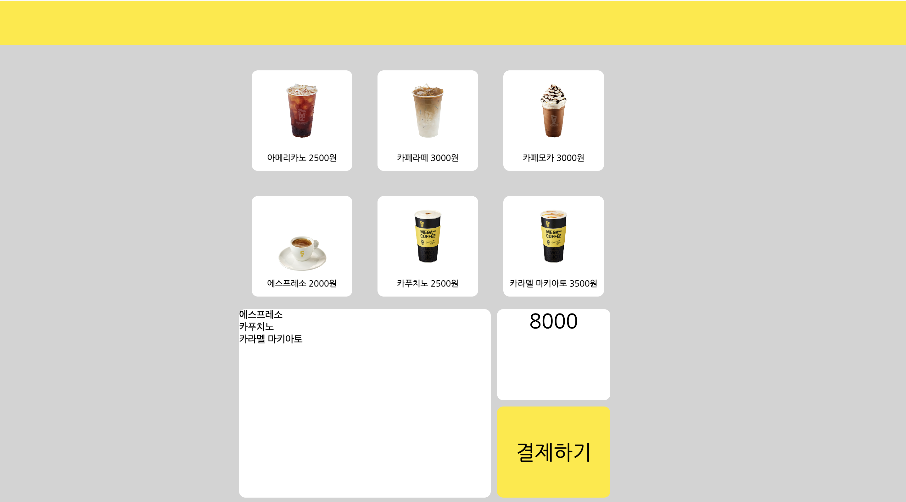

# SSU-webOS-Kiosk

Main color  : #FFEA00   #704E2F
Sub color ; #FFFFFF     #000000

<h2>Soongsil University WebOS OpenSource practice project</h2>

<h3>json 내 필드들(메뉴명)은 PascalCase로 작성합니다. 그외의 파일명, id, class는 camelCase로 작성합니다.</h3>

<h3>History</h3>
<h4>(11/23)Update startScene(index.html)</h4>
<h4>(11/30-12/01)Update menuScene with menu and functions</h4>
<h5>메뉴씬에 헤더를 달고, 메뉴를 json 파일로 분리한 뒤 자바스크립트에서 동적으로 html에 넣어주는 방식으로 코딩하였습니다. 그리고 메뉴를 클릭할 경우 장바구니에 담기고 담긴 메뉴들의 총 금액이 하단에 출력됩니다.</h5>

