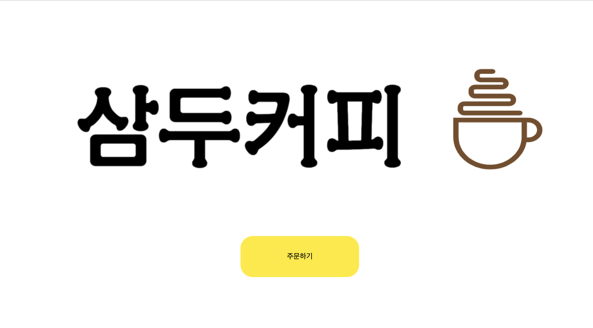
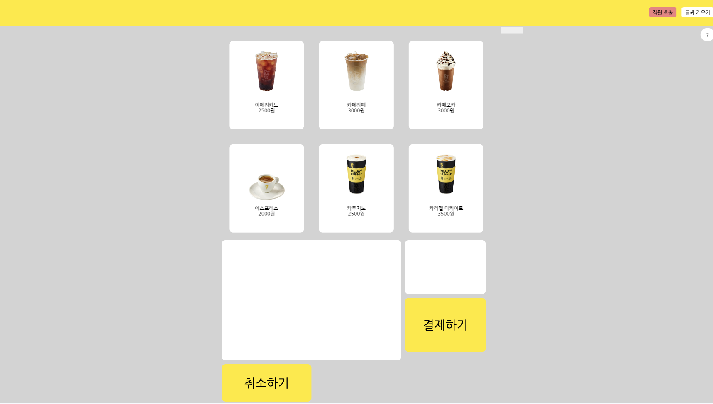
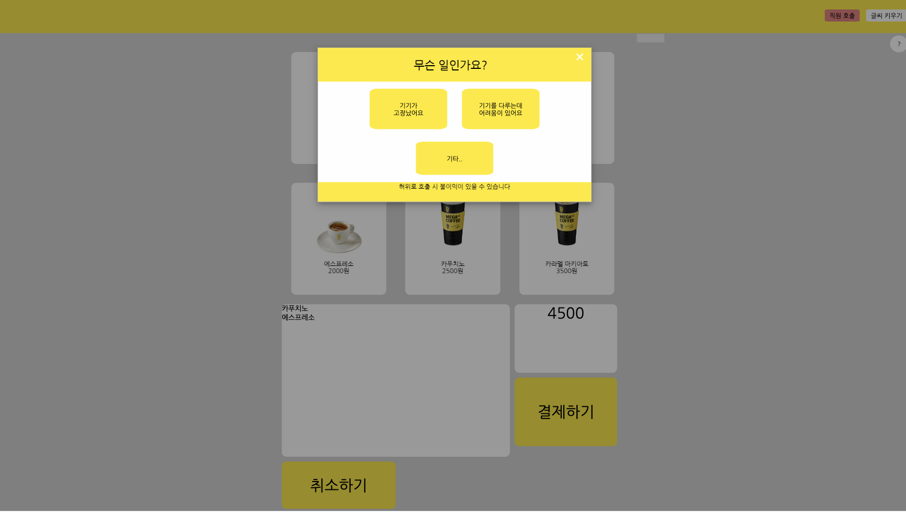
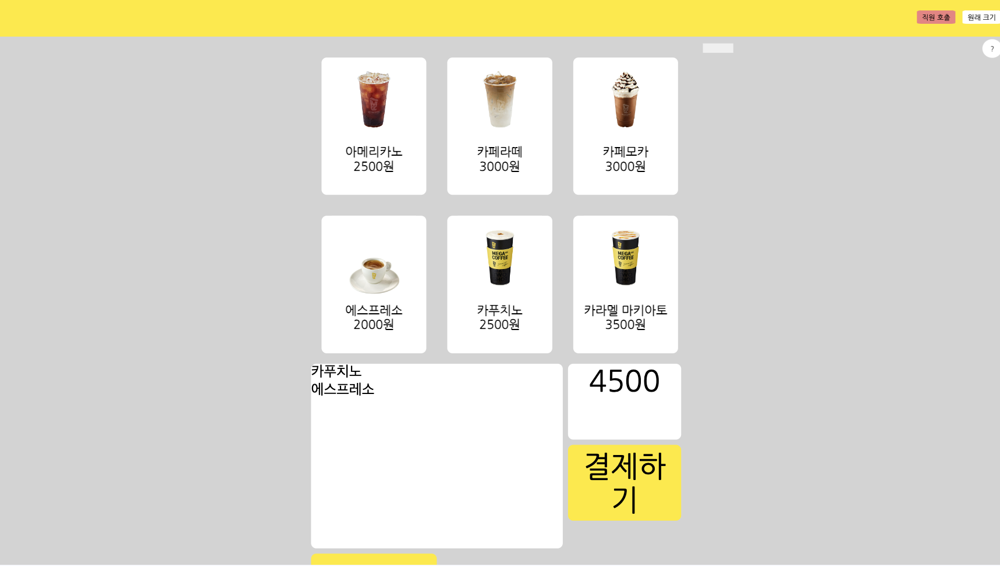
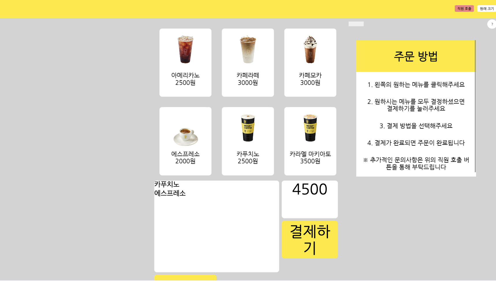
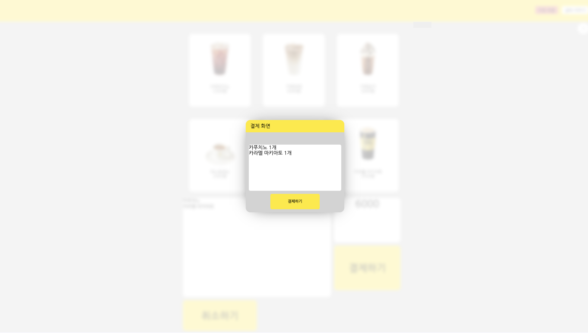

# SSU-webOS-Kiosk

Main color  : #FFEA00   #704E2F
Sub color ; #FFFFFF     #000000

<h2>Soongsil University WebOS OpenSource practice project</h2>

<h3>json 내 필드들(메뉴명)은 PascalCase로 작성합니다. 그외의 파일명, id, class는 camelCase로 작성합니다.</h3>

<h4>3가지 정도의 메인 컬러를 잡고 디자인하였으며 초기화면은 페이드인을 통해 사용자에게 편안한 느낌을 제공해줄 수 있도록 하였습니다.</h4>

<h4>메가커피의 이미지를 사용했으며, 메뉴를 클릭할 경우 밑에 메뉴명이 추가가 되고 전체 총 가격이 나오게 되며 취소하기를 통해 취소할 수 있습니다.</h4>

<h4>직원 호출 기능을 통해 키오스크 사용중 막힘이 발생하였을 때 문의사항을 통해 호출 할 수 있습니다.</h4>

<h4>또한 글씨가 작아 불편을 호소하시는 분들을 위해 폰트 크기를 조정할 수 있는 기능을 추가하였습니다.</h4>

<h4>키오스크의 절차에 익숙치 않으신 분들을 위해 도움말 기능을 추가하여 편의성을 제공합니다.</h4>

<h4>이후 결제버튼을 누를 경우 결제 이외의 모든 화면이 블러처리가 되며, 실제 결제 기능을 구현할 수 없기에 결제를 진행했다는 가정하에 초기화면으로 넘어가게 됩니다.</h4>

